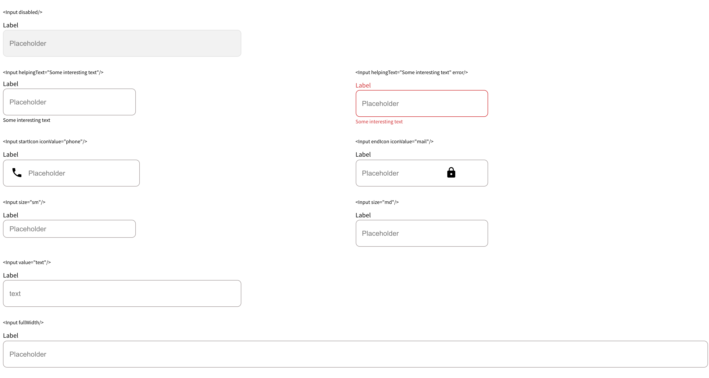

<h1 align="center">Input with props </h1>

<div align="center">
   Solution for a challenge from  <a href="http://devchallenges.io" target="_blank">Devchallenges.io</a>.
</div>

<div align="center">
  <h3>
    <a href="https://anthonydecuyper-challenge-input.netlify.app/">
      Demo
    </a>
    <span> | </span>
    <a href="https://github.com/decuyperanthony/input-challenges-dev">
      Solution
    </a>
    <span> | </span>
    <a href="https://devchallenges.io/challenges/ohgVTyJCbm5OZyTB2gNY">
      Challenge
    </a>
  </h3>
</div>

<!-- TABLE OF CONTENTS -->

## Table of Contents

- [Overview](#overview)
  - [Built With](#built-with)
- [Features](#features)
- [How to use](#how-to-use)
- [Contact](#contact)
- [Acknowledgements](#acknowledgements)

<!-- OVERVIEW -->

## Overview



React Input component with props

### Built With

<!-- This section should list any major frameworks that you built your project using. Here are a few examples.-->

- [React](https://reactjs.org/)
- [Sass](https://sass-lang.com/documentation/syntax)
- [Material UI Icon](https://material-ui.com/components/material-icons/)

## Features

<!-- List the features of your application or follow the template. Don't share the figma file here :) -->

This application/site was created as a submission to a [DevChallenges](https://devchallenges.io/challenges) challenge. The [challenge](https://devchallenges.io/challenges/ohgVTyJCbm5OZyTB2gNY) was to build an application to complete the given user stories.

## How To Use

<!-- This is an example, please update according to your application -->

To clone and run this application, you'll need [Git](https://git-scm.com) and [Node.js](https://nodejs.org/en/download/) (which comes with [npm](http://npmjs.com)) installed on your computer. From your command line:

```bash
# Clone this repository
$ git clone https://github.com/decuyperanthony/input-challenges-dev

# Install dependencies
$ yarn

# Run the app
$ yarn start
```
## Usage
```jsx
import React from 'react';
import Input from 'Input';

const App = () => {
  return (
    <Input size="lg" error />
  )
};

export default App;
```
## Props
|Prop name        |Type          |value     |Default            |Description
|-----------------|------------|-------|-------------------|--------------------------------
|size         | `string`    |`'sm' `      | `'md'`  | Size of the button
|error        | `boolean`  | |    `'true'`               | Set error Class to input
|iconValue        | `string`  | |    `'mail', 'password' 'phone'`               | Disabled shadow of the button
|startIcon, endIcon        | `boolean`  | |                  | Add position icon to the button
|disabled        | `boolean`  | |    `'true' `               | Disabled the button
|fullwidth        | `boolean`  | |    `'true' `               | full width
|value        | `string`  | |    `'anything you want' `               | set the place holder value
|helpingText        | `string`  | |    `'anything you want' `               | set a helper text at the bottom of the input


## Acknowledgements

<!-- This section should list any articles or add-ons/plugins that helps you to complete the project. This is optional but it will help you in the future. For exmpale -->

- [Steps to replicate a design with only HTML and CSS](https://devchallenges-blogs.web.app/how-to-replicate-design/)
- [Node.js](https://nodejs.org/)
- [Marked - a markdown parser](https://github.com/chjj/marked)

## Contact

- Website [https://anthonydecuyper.netlify.app/](https://anthonydecuyper.netlify.app/)
- GitHub [@decuyperanthony](https://github.com/decuyperanthony)